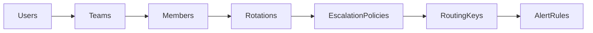

# Splunk On-Call Migration Guide

Deep reference for exporting and migrating Splunk On-Call (VictorOps) configuration. For installation, credentials, and step-by-step commands, start with [`README.md`](../README.md). After discovery, optionally record results using [`VALIDATION_REPORT.md`](VALIDATION_REPORT.md).

---

## Objective

Build a **complete, durable configuration snapshot** of a Splunk On-Call org:

1. **API discovery** — export all public-API-discoverable config to JSON
2. **Manual capture** — document gaps the API cannot list (integrations, global permissions, SSO)
3. **Apply** — provision target org from inventory + remapping

Terraform was evaluated and rejected for the apply step: the `splunk/victorops` provider doesn't cover all resources and is inconsistently maintained. Target-org provisioning is implemented in `apply.py` instead.

---

## Quick reference

### Migration workflow

| Step | Action | Command | Output / note |
| :--- | :--- | :--- | :--- |
| 1 | Discovery | `python3 discovery.py` | `inventory/*.json`, `inventory_summary.md` (~30–40 min for large orgs) |
| 2 | Validation | `python3 validate_inventory.py` | Exit 0/1 — consistency checks |
| 3 | Remapping | `python3 generate_remapping.py` | `inventory/remapping.json` — edit manually; set `null` to skip |
| 4 | Pre-flight | `python3 validate_apply.py` | Exit 0/1 — remapping integrity |
| 5 | Dry run | `python3 apply.py` | No writes to target org |
| 6 | Apply | `python3 apply.py --apply` | `inventory/apply_report.json` |

**uv:** With a project `.venv`, prefix commands with `uv run` (e.g. `uv run python3 discovery.py`). Without a venv, use `uv run --with requests python3 <script>.py` for any pipeline script.

### Safety and important notes

- **Dry runs:** Always run `python3 apply.py` without `--apply` first.
- **Immutable resources:** Escalation policies are **immutable via API after creation**. Validate remapping carefully before `--apply`.
- **Overwrites:** Re-running `generate_remapping.py` overwrites `inventory/remapping.json`. Back up manual edits first.

### Scope

**Included in automated apply:** `users`, `teams`, `members`, `rotations`, `escalation_policies`, `routing_keys`, `alert_rules`

**Deferred:** `contact_methods`, `paging_policies`, `outbound_webhooks`, `active_overrides`, `integrations`, `SSO`

**Manual after apply:** Team admins (no public POST API)

---

## Repository layout

| Path | Purpose |
| :--- | :--- |
| `discovery.py` | Read-only exporter. Four-phase pipeline; threaded per-entity fetch with shared 2 req/sec limit |
| `validate_inventory.py` | Post-discovery consistency checks (no API) |
| `generate_remapping.py` | Build `remapping.json` template from inventory |
| `validate_apply.py` | Pre-flight remapping + relational integrity checks |
| `apply.py` | Target-org provisioning (dry-run default; `--apply` to write) |
| `env_loader.py` | Project-root `.env` loading (shared by `discovery.py` and `apply.py`) |
| `utils.py` | Shared `RateLimiter` (VictorOps API throttle) |
| `summary_reporter.py` | Markdown `inventory_summary.md` generation from on-disk JSON |
| `exceptions.py` | `MigrationError`, `NetworkError`, `ApiError` |
| `migration_types.py` | Shared type aliases (`InventoryCounts`, etc.) |
| `tests/` | Mocked unit tests (no live API calls) |
| `docs/` | Migration guide and post-discovery validation template (`VALIDATION_REPORT.md`) |
| `inventory/` | API export output and `remapping.json` (gitignored) |
| `manual_capture/` | Manual capture templates and operator notes (gitignored) |
| `README.md` | Quick start, workflow, scope |
| `.env` | Source/target API credentials (gitignored) |
| `.env.example` | Credential template |

**Installation and configuration:** Same as [README Quick Start](../README.md#quick-start). Scripts load `.env` from the project root automatically (not cwd-dependent). Shell `export` values take precedence over `.env`.

**Run scripts:**

```bash
python3 discovery.py
# uv (project venv):  uv run python3 discovery.py
# uv (ephemeral):     uv run --with requests python3 discovery.py
```

Replace `discovery.py` with any pipeline script (`validate_inventory.py`, `generate_remapping.py`, `validate_apply.py`, `apply.py`).

Every pipeline script supports `-h` / `--help` for flags and defaults (e.g. `python3 apply.py -h`).

### CLI reference

| Script | Flags | Default paths |
| :--- | :--- | :--- |
| `discovery.py` | `--inventory` | `inventory` |
| `validate_inventory.py` | `--inventory` | `inventory` |
| `generate_remapping.py` | `--inventory`, `--remapping` | `inventory`, `inventory/remapping.json` |
| `validate_apply.py` | `--inventory`, `--remapping` | same |
| `apply.py` | `--apply`, `--inventory`, `--remapping` | same |

**Run tests:**

```bash
python3 -m unittest discover -s tests -t . -v
# uv: uv run python3 -m unittest discover -s tests -t . -v
```

---

## Phase 1: API discovery

### Pipeline

| Phase | Scope | Exports |
| :--- | :--- | :--- |
| 1/4 Global | Org-wide list endpoints | users, teams, routing keys, alert rules, webhooks |
| 2/4 User-scoped | Per-user loop | contact methods, paging policies |
| 3/4 Team-scoped | Per-team loop | members, admins, rotation definitions, escalation summaries, schedules, active overrides |
| 4/4 Policy details | Per unique policy slug | full escalation steps and entries |

Integrations are skipped — no public list endpoint exists.

### Inventory files

| File | Scope | Notes |
| :--- | :--- | :--- |
| `users_inventory.json` | Global | User accounts |
| `teams_inventory.json` | Global | Team slugs and metadata |
| `routing_keys_inventory.json` | Global | Alert routing keys |
| `alert_rules_inventory.json` | Global | Rules sorted by `rank` |
| `outbound_webhooks_inventory.json` | Global | Outbound webhook definitions |
| `contact_methods_inventory.json` | Per-user | Devices, emails, phones |
| `paging_policies_inventory.json` | Per-user | User paging rules |
| `team_members_inventory.json` | Per-team | User-to-team mapping |
| `team_admins_inventory.json` | Per-team | Team administrators |
| `escalation_policies_inventory.json` | Per-team | Policy summaries (name, slug) |
| `escalation_policy_details_inventory.json` | Per-policy | Steps, entries, timeouts |
| `rotation_definitions_inventory.json` | Per-team | Shift config: members, masks, timezone |
| `schedules_inventory.json` | Per-team | Computed on-call calendar (not rotation config) |
| `scheduled_overrides_inventory.json` | Per-team | Active overrides only |
| `discovery_metadata.json` | Global | Counts, timestamps, `files_written`, `manual_capture_required` |
| `inventory_summary.md` | Global | Human-readable Markdown catalog (written by `SummaryReporter`) |
| `remapping.json` | Global | Source-to-target identifier map (steps 3–5) |
| `apply_report.json` | Global | Per-step apply stats and slug maps (after apply) |

### Runtime

Discovery is read-only and throttled (~2 req/sec). Large orgs (1,000+ users, 200+ teams) expect ~30–40 minutes and ~3,000+ API calls. Output goes to `inventory/`; logs to `discovery_run.log`.

### Deliberately excluded

Incidents, alerts, point-in-time on-call snapshots, expired overrides, reporting APIs, per-user team lists (use team-centric members instead).

### Key implementation notes

- `VictorOpsClient.get()` returns full dicts for multi-list responses (e.g. contact methods)
- `required=True` on critical endpoints raises `ApiError` on 404; network failures raise `NetworkError`
- Shared `RateLimiter` in `utils.py` used by discovery and apply clients (~2 req/sec)
- `SummaryReporter` (injected into `DiscoveryPipeline`) writes `inventory_summary.md` from on-disk JSON only
- Overrides fetched org-wide via `GET /overrides`, filtered to active only
- Escalation policies: global `GET /policies` grouped by team; details via `GET /policies/{slug}`
- Rotations: `GET /v2/team/{slug}/rotations` (distinct from schedule calendar)

---

## Phase 2: Manual capture

Three gaps have no public API. Capture from the Splunk On-Call portal and your identity provider. See [`manual_capture/README.md`](../manual_capture/README.md) for the step-by-step checklist.

| Gap | Location | Source |
| :--- | :--- | :--- |
| Integrations | `manual_capture/integrations/` | Portal, Integrations |
| User permissions | `manual_capture/user_permissions/admin_users.md` | Settings, Organization, Users |
| SSO settings | `manual_capture/sso/idp_config.md` | IdP admin console |

**Status tracker:** `manual_capture/capture_status.json`

### Integrations to verify

Common types: ServiceNow, Slack, REST/Generic, outbound webhooks. Cross-reference `alert_rules_inventory.json` and `outbound_webhooks_inventory.json` for hints — do not duplicate secrets.

### SSO constants (Splunk On-Call standard)

| Setting | Value |
| :--- | :--- |
| ACS / Reply URL | `https://sso.victorops.com/sp/ACS.saml2` |
| Entity ID | `victorops.com` |
| Relay state | `https://portal.victorops.com/auth/sso/{org_slug}` |

SSO backend config is coordinated with Splunk support; document IdP-side settings only.

### Security

- Never commit API keys, webhook signatures, integration credentials, or SAML metadata
- Store secrets in a vault; reference paths in templates only
- `inventory/`, `manual_capture/`, `.env` are gitignored

---

## Phase 3: Apply

`apply.py` provisions a target org from `inventory/` using `inventory/remapping.json`.

### Environment

```
TARGET_SPLUNK_ONCALL_API_ID
TARGET_SPLUNK_ONCALL_API_KEY
TARGET_SPLUNK_ONCALL_ORG_SLUG
```

### Commands

```bash
python3 apply.py -h                                           # flags and defaults
python3 apply.py                                              # dry-run (default)
python3 apply.py --apply                                      # execute writes
python3 apply.py --inventory inventory --remapping inventory/remapping.json
```

| Flag | Default | Purpose |
| :--- | :--- | :--- |
| `--apply` | off | Execute writes (default is dry-run) |
| `--inventory` | `inventory` | Inventory directory path |
| `--remapping` | `inventory/remapping.json` | Remapping file path |

Apply report is written to `{inventory}/apply_report.json`.

### Apply order



| Step | API | Notes |
| :--- | :--- | :--- |
| Users | `POST /user` | Remap usernames; skip `null` entries |
| Teams | `POST /team` | Capture returned slug (API-assigned) |
| Members | `POST /team/{slug}/members` | After users and teams exist |
| Admins | — | **No public POST API** — configure in target UI |
| Rotations | `POST /teams/{team}/rotations` | Map source `rtg-*` slugs via label after create |
| Escalation policies | `POST /policies` | **Immutable after create via API** — includes full steps |
| Routing keys | `POST /org/routing-keys` | Target policy slugs from apply step |
| Alert rules | `POST /alertRules` | Preserve `rank`; remap routing-key matches |

### Remapping

`generate_remapping.py` produces six categories: `users`, `teams`, `routing_keys`, `escalation_policies`, `alert_rules`, `outbound_webhooks`. Output defaults to `inventory/remapping.json`. Set any value to `null` to skip that resource. Re-running the generator overwrites the file.

**Alert rule routing keys:** The generator populates `routing_keys` only from `routing_keys_inventory.json`. Rules with `alertField: routing_key` may use pattern match values (for example rotation names) that are not listed as org routing keys. `validate_apply.py` fails if a non-skipped rule references a match value missing from `remapping.routing_keys`. Add the match value under `routing_keys` with the desired target name, or set the rule ID to `null` in `alert_rules` to skip it.

Validate before apply:

```bash
python3 validate_inventory.py
python3 validate_apply.py
```

---

## Validation checklist

After discovery run:

- [ ] `python3 validate_inventory.py` passes
- [ ] All teams in `teams_inventory` have entries in `team_members`, `team_admins`, `rotation_definitions`, `schedules`
- [ ] Every policy slug in routing key targets appears in `escalation_policy_details`
- [ ] `discovery_metadata.json` counts and `files_written` match on-disk files
- [ ] Zero HTTP 404s on required endpoints in `discovery_run.log`
- [ ] Unit tests pass
- [ ] Optional: fill in [`VALIDATION_REPORT.md`](VALIDATION_REPORT.md) template

Before apply:

- [ ] `python3 generate_remapping.py` run (or `inventory/remapping.json` manually maintained)
- [ ] Alert-rule routing key match values are present in `remapping.json` or the rule ID is set to `null`
- [ ] `python3 validate_apply.py` passes
- [ ] `python3 apply.py` dry-run reviewed

After manual capture:

- [ ] Every enabled integration tile has a JSON file in `manual_capture/integrations/`
- [ ] Global admins recorded; team admins spot-checked against API inventory
- [ ] IdP SSO documented with correct relay state for org slug
- [ ] `capture_status.json` all items `complete`

---

## Related documentation

- [`README.md`](../README.md) — quick start, installation, workflow
- [`VALIDATION_REPORT.md`](VALIDATION_REPORT.md) — post-discovery validation template
- [`manual_capture/README.md`](../manual_capture/README.md) — integrations, permissions, SSO capture
- [VictorOps public API docs](https://portal.victorops.com/public/api-docs.html)
- [Splunk On-Call SSO documentation](https://help.splunk.com/en/splunk-enterprise/alert-and-respond/splunk-on-call/introduction-to-splunk-on-call/single-sign-on)
