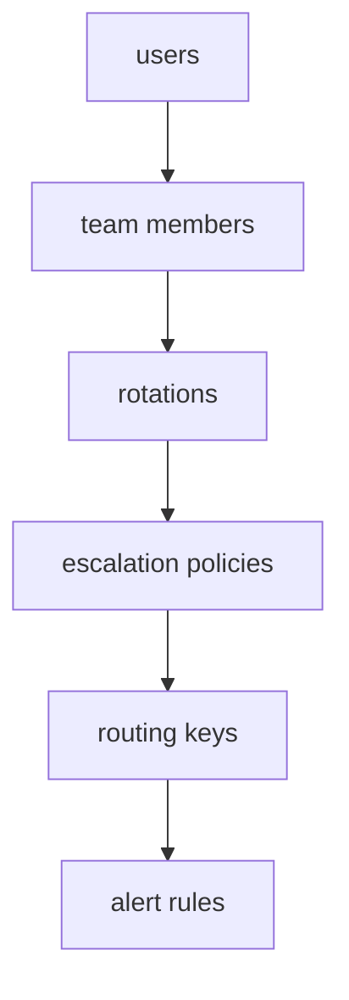
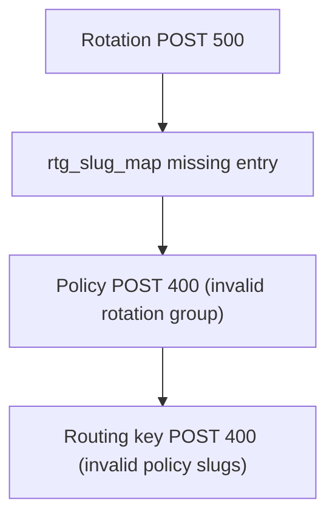

# Migration Troubleshooting & Edge Cases

Symptom → cause → fix for issues encountered when running `apply.py` and
`apply_contact_methods_and_policies.py` against a target Splunk On-Call org.

All examples use placeholders — substitute your own values:

- `{TARGET_ORG}` — target org slug
- `{TEAM_SLUG}` — a team slug (e.g. `team-xxxxxxxx`)
- `{USER}` — a source username; `{TARGET_USER}` — its remapped target username
- `{ROTATION}` — a rotation label
- `@example.com` — an email domain

Resource dependencies flow in one direction, so a failure early in the chain
cascades to everything downstream:



---

## Skipped / departed users on an active team

**Symptom:** `validate_apply.py` flags a user referenced by an active team or
rotation that is set to `null` in `remapping.json`.

**Cause:** Departed or intentionally-excluded users are mapped to `null` so
apply skips them. This is expected, not an error.

**Fix:** No action needed. The validator emits a **warning** (not an error) for
skipped users on active teams and in rotation shift members. Apply excludes them
at runtime. Only treat it as an error if the user *should* have migrated — in
which case give them a non-null target username.

```json
"users": {
  "{USER}": null
}
```

---

## Empty shifts / empty rotation groups

**Symptom:** A rotation exists in inventory but has shifts with no members, or a
rotation group with no valid shifts.

**Cause:** After filtering skipped users, a shift can end up with zero members.
Posting an empty shift or rotation body is rejected by the API.

**Fix:** Handled automatically. `apply.py` (`_build_rotation_payload`) skips
shifts with no remapped members and skips rotations whose shifts all drop out,
logging a warning for each. No invalid POST is sent.

---

## Rotation POST returns HTTP 500 (retry storm)

**Symptom:** A rotation create hangs or logs repeated 500s before failing.

**Cause:** An invalid rotation payload triggers a server 500; the default HTTP
retry policy re-sends it several times, multiplying noise and slowing the run.

**Fix:** Rotation creates use `post_once` (no automatic retries), so a single
error body is logged once. On failure, apply also logs the rotation POST payload
so you can inspect exactly what was rejected. Read the logged `resp.text` and
payload to find the offending field or member.

---

## Cascade failure: rotation 500 → policy 400 → routing-key 400

**Symptom:** A rotation fails with HTTP 500, then escalation policies fail with
`Invalid rotation group slug`, then routing keys fail with `Invalid policy
slugs`. Looks like three separate bugs.

**Cause:** One root cause. When a rotation fails to create, its target slug never
lands in the in-memory `rtg_slug_map`. Policies that reference that rotation
group then have nothing to map to (400), so they are not created; routing keys
that reference those policies then have no policy slug (400).



**Fix order:**

1. Capture the rotation 500 response body and the logged POST payload.
2. Resolve the rotation failure (usually a member who does not exist or is not on
   the team — see the two sections below).
3. Re-run apply. Once the rotation creates, `rtg_slug_map` populates and policies
   then routing keys cascade successfully on the same or next run.

Apply includes **cascade guards**: it does not POST a policy when a referenced
rotation group is unresolved, and does not POST a routing key when its target
policy is unresolved. This prevents doomed 400s and keeps the failure report
focused on the true root cause.

---

## User create HTTP 409 "email already registered"

**Symptom:**

```
POST .../user -> 409: {"error": "The email address {USER}@example.com is already registered"}
FAILED user create: {USER} -> {TARGET_USER} (HTTP 409)
```

**Cause:** The target org already has that email address bound to a *different*
username than the one you are trying to create. The intended target username may
not exist at all (`GET /user/{TARGET_USER}` returns 404) even though the email is
taken.

**Fix — choose one:**

- **A. Remap to the existing account (preferred if same person):** Find the
  target user that owns the email (search by email, not username), then point the
  remapping at that username and re-run. Do not try to create a new user.

  ```json
  "users": { "{USER}": "{existing_target_username}" }
  ```

- **B. Free the email, then create:** Have an admin correct or remove the
  conflicting account, then create the intended username (manual POST or re-run
  the apply users step).

- **C. Defer:** Set the user (and optionally the email) to `null` to unblock the
  run, and onboard them manually later (see "Deferring a user").

**Watch for typos:** Compare the email in the 409 message against the email in
inventory/remapping. A one-character mismatch (e.g. a dropped letter) means the
target account and your inventory disagree; fix the email in the source of truth
before retrying.

---

## Rotation references a user who is not a team member

**Symptom:** A rotation create fails even though every referenced user exists
(`GET /user/{TARGET_USER}` returns 200).

**Cause:** A rotation belongs to a team, and every shift member must also be a
**member of that team**. A user who exists in the org but is not on the team
causes the rotation POST to be rejected.

**Fix:** Add the user to the team before applying rotations, then re-run.

```bash
curl -X POST "$TARGET_BASE/team/{TEAM_SLUG}/members" \
  -H "Authorization: GenieKey $TARGET_API_KEY" \
  -H "Content-Type: application/json" \
  -d '{"username":"{TARGET_USER}"}'
```

Re-running full apply also adds any missing members (`apply_members` skips users
already on the team), but the user must **exist** first — a user still failing
creation (see the 409 case) will not be added.

Verify before applying rotations:

```bash
curl "$TARGET_BASE/team/{TEAM_SLUG}/members" \
  -H "Authorization: GenieKey $TARGET_API_KEY"
```

---

## Target username does not follow the suffix convention

**Symptom:** Rotation or member apply fails on a single user whose target
username differs from the pattern used for everyone else.

**Cause:** Remapping can map each source username independently. One user's
target account may have been provisioned without the common suffix (or with a
different form entirely), so a mechanical suffix assumption is wrong for them.

**Fix:** Confirm the real target username and set it explicitly in
`remapping.json`. Verify with `GET /user/{target_username}` (expect 200) before
rotation apply rather than assuming the suffix.

---

## Deferring a user

**When:** A user blocks the run (e.g. unresolved 409 email conflict) but you want
to complete the rest of the migration now.

**How:** Set the user to `null` in `remapping.json` (optionally null the email
too, mirroring how departed users are handled):

```json
"users": { "{USER}": null },
"emails": { "{USER}@example.com": null }
```

**Effect:**

- `apply.py` skips the user create, team member add, and drops them from rotation
  shift members (the shift still posts if other members remain).
- `apply_contact_methods_and_policies.py` skips the user entirely (no contact
  methods or paging steps).
- `validate_apply.py` reports warnings, not errors, for the skipped user.

**Re-enable later:** Once the target account exists, restore the non-null mapping
and re-run apply (and the deferred script). Then finish any placements the API
cannot infer — e.g. add the user to the correct rotation shift in the UI if the
rotation was already created without them.

---

## Idempotency and re-running apply

**Safe to re-run:** Users, teams, members, rotations, and escalation policies are
skipped when they already exist on the target (GET preflight or name/label
match). A second run is largely no-ops for these.

**Watch out:**

- **Routing keys and alert rules** may be posted again and can duplicate or fail
  if they already exist.
- **A policy created with wrong steps cannot be fixed by re-applying** — correct
  it in the target UI, or delete and recreate it, adjusting remapping if needed.
- **Duplicate contact-method POSTs return HTTP 500.** The deferred script uses a
  GET preflight to skip emails, phones, and matching paging steps already on the
  target, so a second `--apply` should be mostly skips. Dry-run does not query
  the target, so it cannot show what already exists — always dry-run, then
  `--apply`, then `--apply` once more to confirm idempotency.

---

## Items that cannot be migrated via the public API

These require manual work in the target UI or identity provider — they are not
covered by any apply script:

| Item | Where it lives in inventory | Manual action |
| :--- | :--- | :--- |
| Team admins | `team_admins_inventory.json` | Assign in target UI (no public POST) |
| Scheduled overrides | `scheduled_overrides_inventory.json` | Recreate in target UI |
| Push / mobile devices | `contact_methods_inventory.json` | Users re-register by logging in on the target app |
| Integrations | `manual_capture/` | Recreate per `manual_capture/README.md` |
| SSO / org auth | identity provider | Configure from IdP |

---

## Quick diagnostic checklist

- [ ] Read the **first** failure in the log — later 400s are often cascade
      effects, not independent bugs.
- [ ] For a rotation failure, inspect the logged POST payload and confirm every
      member both **exists** and is a **team member**.
- [ ] For a user 409, search the target org by **email** to find the real owner.
- [ ] Check the apply report `failures` block for the exact usernames / rotations
      that failed.
- [ ] After fixing a root cause, re-run and confirm downstream resources cascade.
