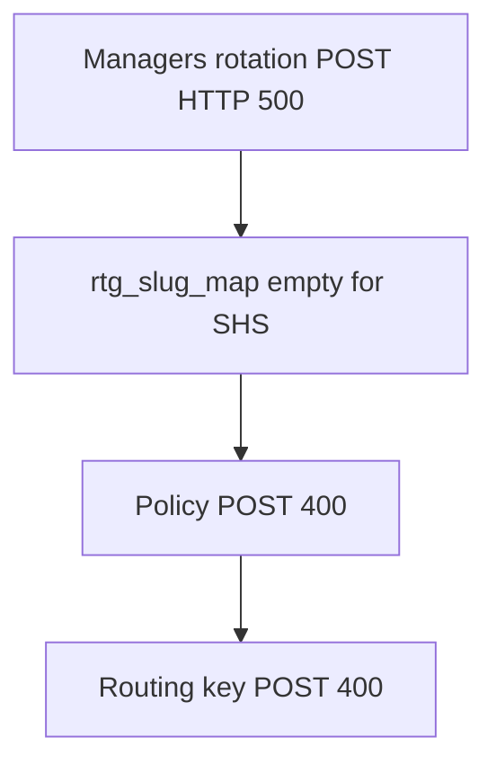

# Discovery Validation Report (Template)

Use this document after each `discovery.py` run to record validation results. Copy sections into a local note or fill in placeholders below — do not commit org-specific counts or credentials.

**Authoritative run data** (gitignored) lives in:

- `inventory/discovery_metadata.json` — counts, timestamps, `files_written`
- `discovery_run.log` — HTTP errors and warnings
- `inventory/*.json` — exported configuration

Automated regression coverage: `[tests/](../tests/)` — includes `test_discovery.py`, `test_summary_reporter.py`, `test_rate_limiter.py`, and other pipeline tests.

---


## Run metadata


| Field                          | Value                             |
| ------------------------------ | --------------------------------- |
| Date                           | `YYYY-MM-DD`                      |
| Org slug                       | `{SOURCE_SPLUNK_ONCALL_ORG_SLUG}` |
| Validator                      | `{name}`                          |
| Discovery runtime              | `{duration}`                      |
| Estimated API calls            | `{count}`                         |
| HTTP 404 on required endpoints | `{0 or count}`                    |
| Errors / crashes               | `{0 or describe}`                 |
| Overall status                 | `PASS` / `FAIL` / `IN PROGRESS`   |


---


## Executive summary

Record verdicts after reviewing `inventory/` and `discovery_metadata.json`.


| Inventory file                             | Verdict | Count | Notes                                                         |
| ------------------------------------------ | ------- | ----- | ------------------------------------------------------------- |
| `users_inventory.json`                     |         |       |                                                               |
| `teams_inventory.json`                     |         |       |                                                               |
| `routing_keys_inventory.json`              |         |       |                                                               |
| `alert_rules_inventory.json`               |         |       | Sorted by `rank`                                              |
| `outbound_webhooks_inventory.json`         |         |       |                                                               |
| `contact_methods_inventory.json`           |         |       | Per user: `devices`, `emails`, `phones`                       |
| `paging_policies_inventory.json`           |         |       |                                                               |
| `team_members_inventory.json`              |         |       | Dict keyed by team slug                                       |
| `team_admins_inventory.json`               |         |       | Dict keyed by team slug                                       |
| `escalation_policies_inventory.json`       |         |       | Dict keyed by team slug                                       |
| `escalation_policy_details_inventory.json` |         |       | Dict keyed by policy slug                                     |
| `rotation_definitions_inventory.json`      |         |       | Dict keyed by team slug                                       |
| `schedules_inventory.json`                 |         |       | Dict keyed by team slug                                       |
| `scheduled_overrides_inventory.json`       |         |       | Active overrides only                                         |
| `discovery_metadata.json`                  |         |       | Counts match on-disk files; scoped runs include `scope` block |
| `inventory_summary.md`                     |         |       | Generated by `SummaryReporter` after discovery                |
| `integrations_inventory.json`              | N/A     | —     | Not exported — no public API                                  |


**Overall:** Discovery against org `{ORG_SLUG}` completed in `{duration}`. `{Summary: e.g. zero 404s on required endpoints; structural checks passed; issues listed below.}`

---


## Live validation runbook

Run discovery, then validate output:

```bash
cp .env.example .env   # edit with SOURCE_SPLUNK_ONCALL_* credentials
python3 discovery.py 2>&1 | tee discovery_run.log
# uv (project venv): uv run python3 discovery.py 2>&1 | tee discovery_run.log
# uv (ephemeral):    uv run --with requests python3 discovery.py 2>&1 | tee discovery_run.log

python3 validate_inventory.py
# uv: uv run python3 validate_inventory.py
```

---


## Automated checks

- [ ] `python3 validate_inventory.py` exits 0
- [ ] Zero HTTP 404s on **required** endpoints in `discovery_run.log`
- [ ] `discovery_metadata.json` `inventory_counts` match on-disk file lengths
- [ ] `discovery_metadata.json` `files_written` matches on-disk files (if present)
- [ ] `python3 -m unittest discover -s tests -t . -v` passes

**Scoped discovery:** If `discovery_metadata.json` contains a `scope` object, the export is partial (team slugs in `scope.teams`). Expect fewer rows in inventory files, `outbound_webhooks_inventory.json` may be `[]`, and `validate_inventory.py` may warn when `scope.expanded_teams` includes teams added by policy closure.

---


## Structural spot-checks

Manual review after automated checks pass:

- [ ] **Contact methods:** Sample user entry contains `devices`, `emails`, and `phones` keys
- [ ] **Alert rules:** Rules sorted ascending by `rank`
- [ ] **Team coverage:** Every team slug in `teams_inventory.json` appears in `team_members`, `team_admins`, `rotation_definitions`, and `schedules`
- [ ] **Routing keys:** Each routing key's target policy slug exists in `escalation_policy_details_inventory.json`
- [ ] **Escalation policies:** Policy detail entries include steps with `timeout`, `entries`, `executionType`
- [ ] **Rotation definitions:** Per-team `rotations[]` with `shifts[]`, `mask`, `timezone`
- [ ] **Overrides:** Only active overrides present; expired overrides excluded
- [ ] **UI cross-check (optional):** User and team counts match Splunk On-Call portal

---


## Per-file validation notes


| File                                       | Expected structure                                                                      | Common failure modes                                   |
| ------------------------------------------ | --------------------------------------------------------------------------------------- | ------------------------------------------------------ |
| `users_inventory.json`                     | List of user objects                                                                    | Empty list; auth failure                               |
| `teams_inventory.json`                     | List of team objects                                                                    | Empty list; bare-list parse error                      |
| `routing_keys_inventory.json`              | List of routing key objects                                                             | Empty; wrong response key                              |
| `alert_rules_inventory.json`               | List sorted by `rank`                                                                   | Empty `[]` if wrong endpoint (`/alertRules` required)  |
| `outbound_webhooks_inventory.json`         | List of webhook definitions                                                             | Empty if wrong path (`/webhooks` not org-scoped)       |
| `contact_methods_inventory.json`           | Dict per username with `devices`, `emails`, `phones`                                    | Missing `emails`/`phones` keys; empty dict if user has no methods |
| `paging_policies_inventory.json`           | Dict per username → list of step objects (`order`, `timeout`, `contactType`)            | Empty list; unexpected wrapper shape                   |
| `team_members_inventory.json`              | Dict keyed by team slug                                                                 | Missing teams vs `teams_inventory`                     |
| `team_admins_inventory.json`               | Dict keyed by team slug                                                                 | Missing teams vs `teams_inventory`                     |
| `escalation_policies_inventory.json`       | Dict keyed by team slug                                                                 | Missing teams; use global `/policies`                  |
| `escalation_policy_details_inventory.json` | Dict keyed by policy slug                                                               | Missing slugs referenced by routing keys               |
| `rotation_definitions_inventory.json`      | Dict keyed by team slug                                                                 | Missing teams; v2 rotations endpoint                   |
| `schedules_inventory.json`                 | Dict keyed by team slug                                                                 | Deprecated v1 schedule endpoint                        |
| `scheduled_overrides_inventory.json`       | Dict keyed by team slug, active only                                                    | Empty if per-team override path used; use `/overrides` |
| `discovery_metadata.json`                  | Counts, `files_written`, `manual_capture_required`; optional `scope` for partial export | Stale counts after partial re-run                      |


---


## Remaining gaps (all orgs)

These cannot be exported via the public API:

1. **Integrations** — capture manually; see `[manual_capture/README.md](../manual_capture/README.md)`
2. **Global user permissions** — org admin / stakeholder roles not listable via API
3. **SSO / org auth settings** — document from identity provider

Some teams may have no escalation policies — that is expected when teams exist without assigned policies.

---


## Before apply

After remapping is ready, run `python3 validate_apply.py` before any apply dry run. It checks remapping format and relational integrity against inventory.

Alert rules with `alertField: routing_key` may match pattern values not exported in `routing_keys_inventory.json`. If validation reports a missing routing key for a rule, add the match value under `routing_keys` in `remapping.json` or set the rule ID to `null` in `alert_rules` to skip it.

---


## After primary apply (deferred user settings)

Run `python3 apply_contact_methods_and_policies.py` (dry-run) after `apply.py --apply` has created users in the target org. The script applies email/phone contact methods from `contact_methods_inventory.json` and primary paging steps from `paging_policies_inventory.json`, using the same `remapping.json` for username and email translation. Push devices are not migrated via API; push paging steps may warn until users log in on the target.

**Re-run warning:** On `--apply`, the deferred script skips emails, phones, and matching paging steps already present on the target user (GET preflight). Duplicate contact POSTs return HTTP 500 from the API. Dry-run does not query the target org.

---


## Conclusion

> Discovery against org `{ORG_SLUG}` on `{DATE}`: **{PASS / FAIL}**.
>
> {Describe outcome: e.g. all API-discoverable durable configuration exported; list any files that failed or need re-run. Reference `discovery_metadata.json` and `discovery_run.log` for details.}

**Issues / follow-up:**

- {List any failed checks, missing files, or manual capture items still pending}

---

## SHS team workaround cleanup (avenhospitality)

Record results after re-enabling SHS in remapping and re-running apply. Customer inventory for this migration lives under `inventory/avenhospitality/` (gitignored).

### Code fixes applied

| Change | File | Effect |
| :--- | :--- | :--- |
| Skipped users on active teams → warning | `validate_apply.py` | SHS team no longer blocked when departed users remain in inventory |
| Skip empty shifts / rotation groups | `apply.py` | Avoids invalid rotation POST bodies (e.g. empty `SRE Distribution`) |
| `post_once` for rotations | `apply.py` | Logs API error body once (no urllib3 500 retry storm) |
| `failures` in apply report | `apply.py` | Lists failed usernames / rotations for post-mortem |
| Cascade guards | `apply.py` | Skip policy/routing-key POST when rotation groups or policies not mapped on target |
| Rotation shiftMembers check | `validate_apply.py` | Warns on skipped users in rotation shifts (no API calls) |

### Remapping

- Re-enable SHS: `"team-lMBqJ27I2vvYBR7o": "team-lMBqJ27I2vvYBR7o"` (not `null`)
- Keep departed users skipped: `ramakrishna.bhat`, `andres.cifuentes` → `null`
- Confirm `libu.george` → `libugeorge` exists on target before rotation apply: `GET /user/libugeorge`

### Pre-flight (avenhospitality inventory)

```bash
python3 -m unittest discover -s tests -t . -q
python3 validate_inventory.py --inventory inventory/avenhospitality
python3 validate_apply.py --inventory inventory/avenhospitality --remapping inventory/avenhospitality/remapping.json
python3 apply.py --inventory inventory/avenhospitality --remapping inventory/avenhospitality/remapping.json
python3 apply_contact_methods_and_policies.py --inventory inventory/avenhospitality --remapping inventory/avenhospitality/remapping.json
```

Expect `validate_apply.py` **pass with warnings** for departed users on SHS. Dry-run should plan SHS members, **3 rotation groups** (skip empty `SRE Distribution`), **3 escalation policies**, and **3 routing keys**.

### Live apply (requires TARGET = avenhospitality)

Set `TARGET_SPLUNK_ONCALL_*` in `.env` to the **avenhospitality** org (not a dev sandbox). Then:

```bash
python3 apply.py --apply --inventory inventory/avenhospitality --remapping inventory/avenhospitality/remapping.json
python3 apply_contact_methods_and_policies.py --apply --inventory inventory/avenhospitality --remapping inventory/avenhospitality/remapping.json
python3 apply_contact_methods_and_policies.py --apply --inventory inventory/avenhospitality --remapping inventory/avenhospitality/remapping.json
```

Compare `inventory/avenhospitality/apply_report.json` to the prior run: `rotations.created` +3, `escalation_policies.created` +3, `routing_keys.created` +3 (failures → 0). Check `failures` for any remaining issues.

### Failed user from prior primary apply

Prior run: **39 users skipped, 1 failed, 0 created**. Only two mapped users had `verified: false` in source inventory:

| Source user | Target user | Notes |
| :--- | :--- | :--- |
| `elbink.binil` | `elbink.binil-aven` | Unverified in source; on SHS team |
| `aldona.rosemaria` | `aldona.rosemaria-aven` | Unverified in source; on SHS team |

Re-run `apply.py --apply` and inspect logs for `FAILED user create` and `apply_report.json` → `failures.users`. Typical fixes: create user in target UI, fix email conflict in `remapping.emails`, or set `"username": null` if the user should not migrate.

### Manual follow-ups (not covered by apply.py)

| Item | Source | Action |
| :--- | :--- | :--- |
| Team admins (9 on SHS) | `team_admins_inventory.json` | Target UI — no public POST API |
| Scheduled overrides (11 active) | `scheduled_overrides_inventory.json` | Recreate in target UI from inventory |
| Push/mobile devices | `contact_methods_inventory.json` | Users re-login on target app |
| Integrations / SSO | `manual_capture/` | Per `manual_capture/README.md` |

### Live apply cascade (Managers rotation 500 → policy/routing-key 400)

If `--apply` shows **Managers rotation HTTP 500**, then **Invalid rotation group slug** on policies and **Invalid policy slugs** on routing keys, that is one failure chain — not three separate bugs.



**Fix order:**

1. Capture the 500 response body from logs (`post_once` logs `resp.text`). Synced code also logs the rotation POST payload on failure.
2. On target **avenhospitality**, verify rotation users exist and are SHS team members:
   - `GET /user/libugeorge` (remapped from `libu.george`, no `-aven` suffix)
   - `GET /team/team-pAZi8hj16tndsTnT/members` — confirm Managers `shiftMembers` target usernames
3. Re-run `apply.py --apply` with `--inventory inventory_new --remapping inventory_new/remapping.json`
4. If Managers still 500 with all users present: hybrid fallback — POST one shift (EMEA) or create rotation shell in target UI

**Pending repo hardening** (pull latest or apply manually in `apply.py`):

- Do not POST policies when a referenced rotation group is missing from `rtg_slug_map` — **implemented**
- Do not POST routing keys when target policy is missing from `policy_slug_map` — **implemented**
- Log rotation POST JSON payload on HTTP failure — **implemented**

After rotations succeed, expect `slug_maps.rotation_groups` populated, then policies and routing keys should apply on the next run.

---

